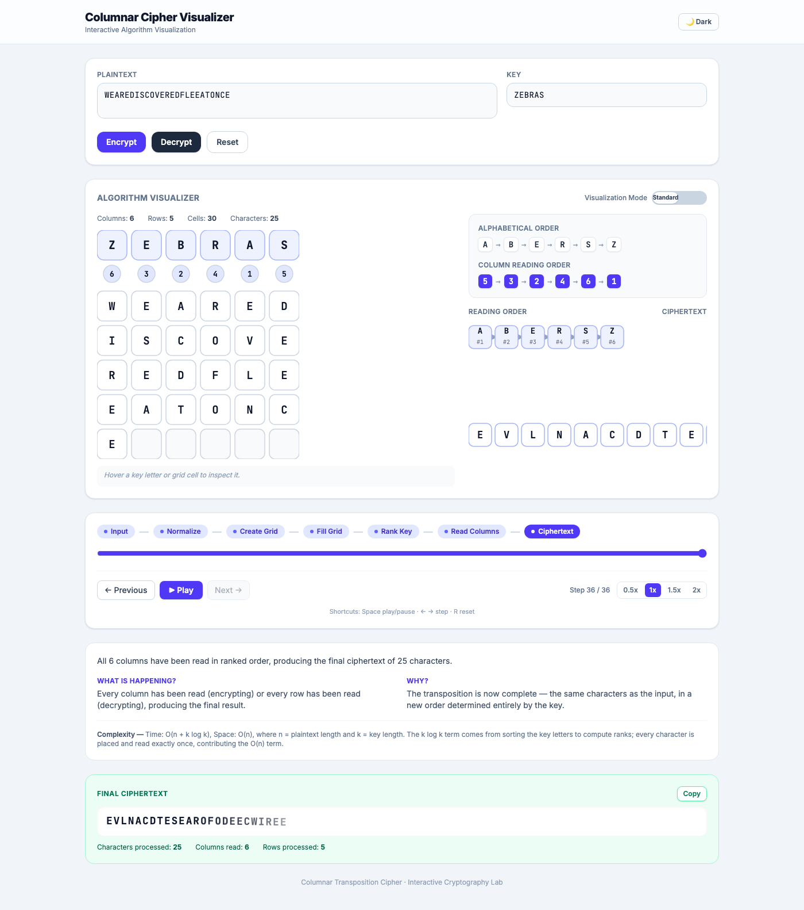
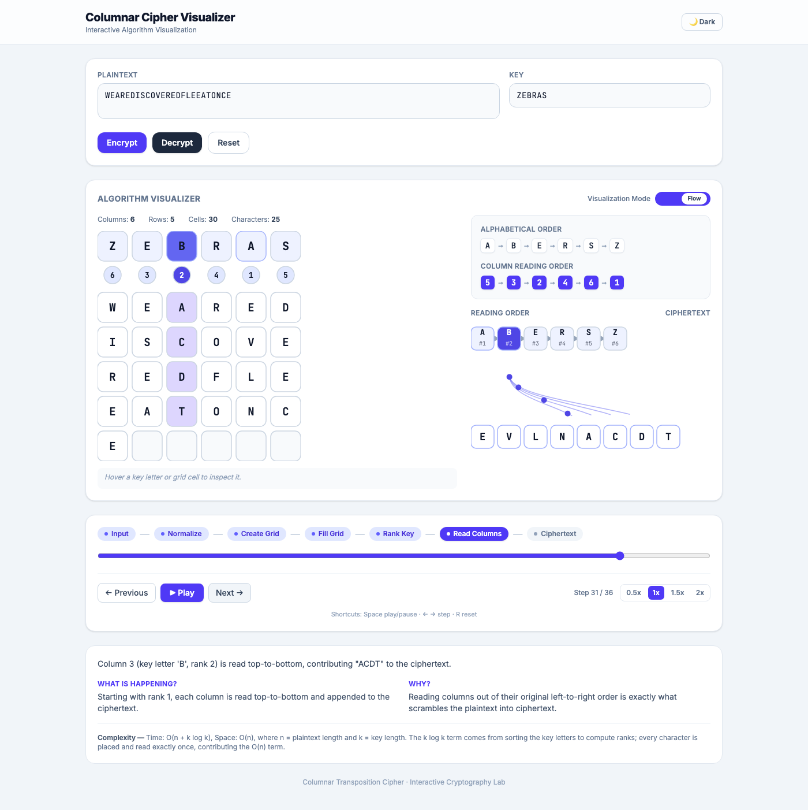
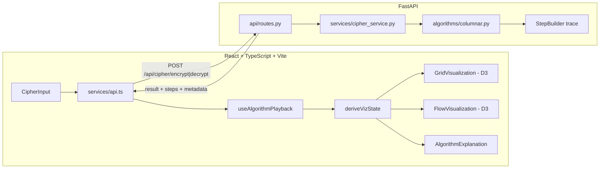
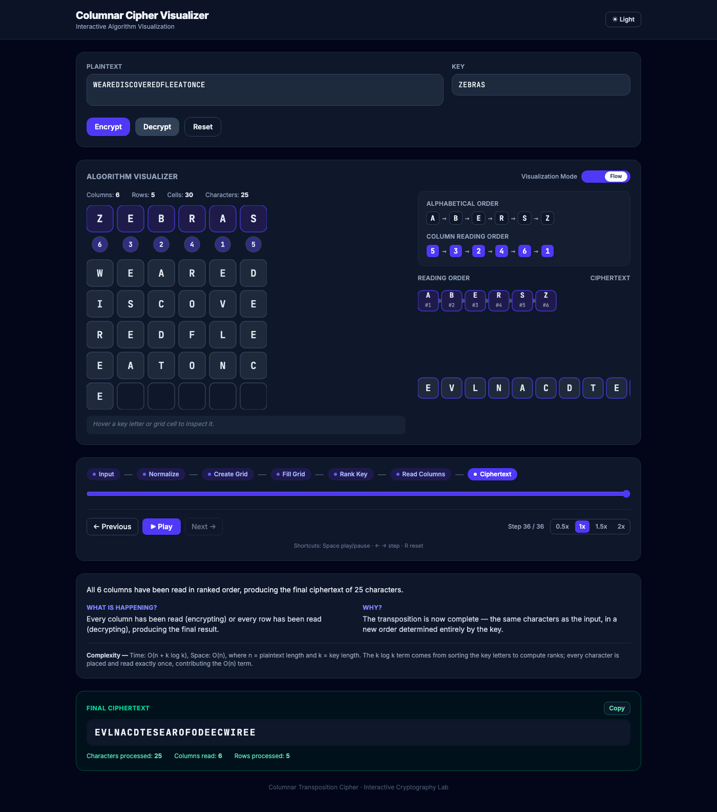
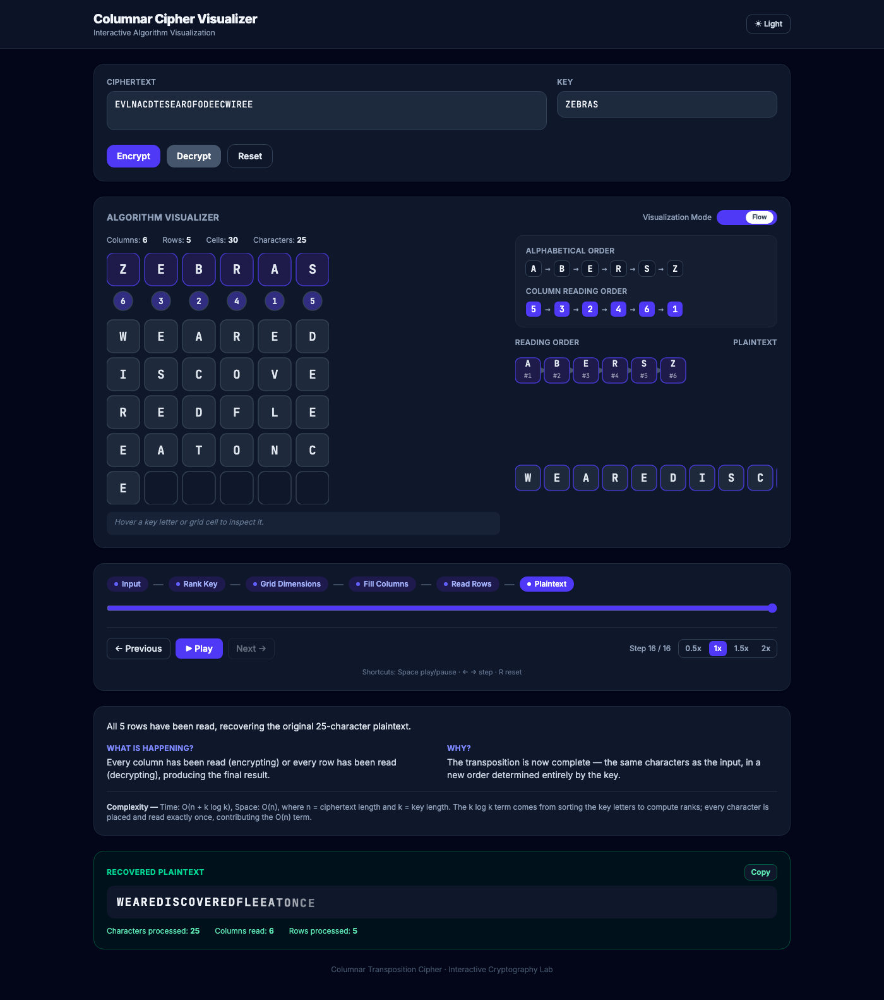

# Columnar Cipher Visualizer

An interactive cryptography lab for learning the **Columnar Transposition Cipher** —
not a form that swaps plaintext for ciphertext, but a step-by-step, animated
walkthrough of the algorithm itself: the grid filling, the key being ranked,
and each column flowing into the final result.



## Features

- **Full algorithm trace, not just a result.** The backend returns every step
  the algorithm took — normalizing text, filling the grid, ranking the key,
  reading each column — as structured JSON. The frontend turns that trace
  into an animation.
- **D3-powered grid and flow visualizations.** SVG cells, ranking badges,
  animated reading-order arrows, and — in **Data Flow mode** — curved,
  animated paths carrying each character from its grid cell into the
  ciphertext.
- **Full playback control.** Step forward/backward, play/pause, 0.5×–2×
  speed, jump to any step via a clickable progress bar or phase timeline.
- **Encrypt and decrypt, both fully visualized** — decryption is a distinct
  trace (distributing ciphertext into columns, then reading rows), not
  encryption run backwards.
- **Interactive, inspectable grid.** Hover any key letter, rank badge, or
  grid cell to see its row/column/read-order metadata.
- **Dark/light theme**, keyboard shortcuts, responsive layout.
- **Deterministic duplicate-key handling** — `BALLOON` ranks its two `L`s and
  two `O`s by original position, and the backend exposes that ranking
  explicitly.



## How the cipher works

**Encryption:**
1. Normalize the plaintext (uppercase, strip anything that isn't a letter/digit).
2. Build a grid with one column per key letter, enough rows for the text.
3. Write the plaintext into the grid left-to-right, top-to-bottom.
4. Rank each key letter by alphabetical order (stable — duplicates keep their
   original left-to-right order).
5. Read the grid column-by-column, in ascending rank order, appending each
   column's characters to the ciphertext.

**Decryption** reverses this deliberately, not by replaying encryption
backwards:
1. Rank the key the same way.
2. Recompute the grid's dimensions and exactly how many characters belong in
   each column (the last, possibly incomplete, row means some columns are
   one character longer).
3. Slice the ciphertext and pour it back into the grid, one column at a time,
   in rank order.
4. Read the reconstructed grid row-by-row to recover the plaintext.

See [`backend/app/algorithms/columnar.py`](backend/app/algorithms/columnar.py)
for the implementation — it's deliberately small and has no knowledge of how
any of this gets drawn on screen.

## Architecture

The backend is an **algorithm execution engine**: given text and a key, it
returns both the final result and a complete, ordered list of steps
(`{ step, type, title, description, state }`). The frontend never
recomputes the cipher — it folds that step list into a view model and lets
D3 animate the transitions. This separation is also what makes the app
extensible to other ciphers later (Caesar, Vigenère, Rail Fence, ...): a new
algorithm just needs to emit the same step-trace shape.



**Backend** (`backend/`)
```
app/
├── main.py              FastAPI app, CORS, error handlers
├── api/routes.py         POST /api/cipher/{encrypt,decrypt}
├── models/schemas.py      Pydantic request/response contracts
├── services/cipher_service.py   Registry mapping algorithm -> functions
└── algorithms/
    ├── base.py            StepBuilder — the step-trace contract
    └── columnar.py         Cipher logic + step emission (no viz knowledge)
```

**Frontend** (`frontend/src/`)
```
components/       Presentational pieces (input, grid wrapper, controls, ...)
visualization/     D3 rendering (GridVisualization, FlowVisualization),
                    plus deriveVizState (folds steps -> current view model)
                    and phases.ts (groups steps into named timeline phases)
hooks/             useAlgorithmPlayback — generic step-sequence playback
services/api.ts     Typed fetch wrapper
types/cipher.ts     Mirrors the backend's step-trace contract
pages/CipherVisualizer.tsx   Orchestrates everything
```

## Technologies

| Layer          | Choice                                   |
|----------------|-------------------------------------------|
| Frontend        | React 19, TypeScript, Vite                |
| Styling         | Tailwind CSS v4                           |
| Visualization   | D3.js (SVG, transitions, path animation)  |
| Backend         | Python, FastAPI, Pydantic v2              |
| Testing         | pytest (backend)                          |
| API             | REST/JSON                                 |

## Installation

### Without Docker

**Backend:**
```bash
cd backend
python -m venv venv
source venv/bin/activate   # Windows: venv\Scripts\activate
pip install -r requirements.txt
uvicorn app.main:app --reload
```
The API is now at `http://localhost:8000` (interactive docs at `/docs`).

**Frontend:**
```bash
cd frontend
npm install
cp .env.example .env   # VITE_API_URL=http://localhost:8000
npm run dev
```
The app is now at `http://localhost:5173` (or the next free port).

### With Docker

```bash
docker compose up --build
```
This builds and runs both services — backend on `:8000`, frontend on `:5173`.

## API

### `POST /api/cipher/encrypt`
### `POST /api/cipher/decrypt`

**Request:**
```json
{ "text": "WEAREDISCOVEREDFLEEATONCE", "key": "ZEBRAS" }
```

**Response** (abbreviated):
```json
{
  "algorithm": "columnar_transposition",
  "operation": "encrypt",
  "input": { "text": "...", "key": "ZEBRAS" },
  "result": "EVLNACDTESEAROFODEECWIREE",
  "steps": [
    { "step": 1, "type": "input", "title": "Input", "description": "...", "state": {} },
    { "step": 2, "type": "normalize", "title": "Normalize plaintext", "description": "...", "state": { "normalizedText": "..." } },
    { "step": 5, "type": "key_ranking", "title": "Rank the key alphabetically", "description": "...",
      "state": { "ranks": [6,3,2,4,1,5], "readingOrder": [4,2,1,3,5,0] } }
  ],
  "metadata": { "rows": 5, "columns": 6, "ranks": [6,3,2,4,1,5], "readingOrder": [4,2,1,3,5,0] }
}
```

Errors return `422` with `{ "detail": "..." }` for invalid input (empty
text/key, or text/key that's empty after normalization); unexpected server
errors return a generic `500` — raw stack traces are never sent to clients.

Full interactive documentation (generated from the Pydantic schemas) is
available at `http://localhost:8000/docs` once the backend is running.

### Validation policy

- Both plaintext/ciphertext and key are uppercased; any character that
  isn't a letter or digit is stripped (and reported in the `normalize` step
  and `removed*Chars` metadata).
- A key longer than the text is allowed — it just produces a single row with
  some empty columns.
- Duplicate key letters are ranked by a stable sort, so they keep their
  original left-to-right order (e.g. `BALLOON`'s two `L`s and two `O`s).

## Testing

```bash
cd backend
source venv/bin/activate
pytest -v
```

The suite (`backend/tests/`) covers the classic `ZEBRAS` known-answer case,
round-trips across a range of inputs, duplicate-key ranking, edge cases
(empty text/key, single-character key, key longer than text, text exactly
and not exactly divisible by key length), and internal consistency of the
step trace itself (step numbers are sequential, `place_character` steps
cover every input character, `read_column` steps reconstruct the ciphertext
in rank order, etc.).

## Screenshots

| Encrypt (light) | Data flow mode (dark) |
|---|---|
|  |  |

| Decrypt (dark) | Animated packet flow |
|---|---|
|  |  |

## Future improvements

- Additional ciphers (Caesar, Vigenère, Rail Fence, Playfair) reusing the
  same step-trace contract and playback engine.
- Persisting/sharing a specific run via a URL (encode text + key + step).
- An "attack" mode that visualizes brute-forcing an unknown key length.
